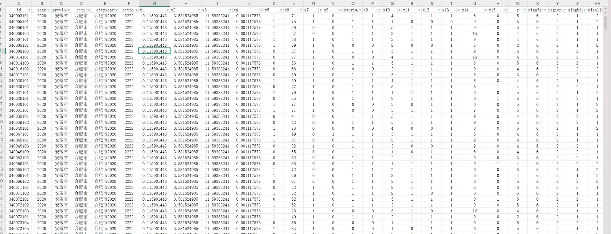
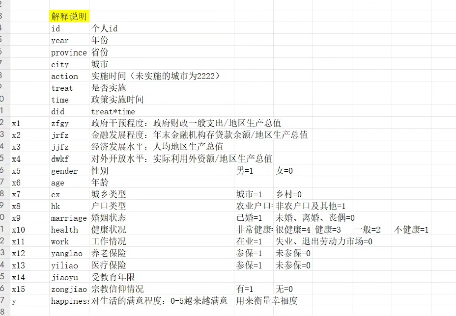

## Body

CFPS (China Family Panel Studies) is a longitudinal study of Chinese families, which has been collecting data on various aspects of family life since 2003. The CFPS dataset includes information on various topics such as income, education, health, and happiness. In this case, the focus is on the happiness of residents in China.

The dataset used in this analysis is from 2010 to 2020, with data collected for even-numbered years. This means that we have data for 2010, 2012, 2014, 2016, 2018, and 2020.

To measure the level of happiness among residents, the CFPS dataset uses a scale of 1 to 5, where 1 represents "very unhappy" and 5 represents "very happy." The specific questions asked in the dataset are:

1. How satisfied are you with your life overall?
2. How satisfied are you with your job?
3. How satisfied are you with your family relationships?
4. How satisfied are you with your community?
5. How satisfied are you with your health?

These questions are designed to capture different dimensions of happiness, including personal satisfaction, work satisfaction, family relationships, community satisfaction, and health. By asking these questions at even-numbered years, we can analyze changes in happiness over time.

## Images

Here is a pay link on Stripe ( https://buy.stripe.com/3cs8yP7sY87d0vu9AB ). Please contact me lonlonago@foxmail.com after funding $89, and I will send you a complete data files , thank you!

